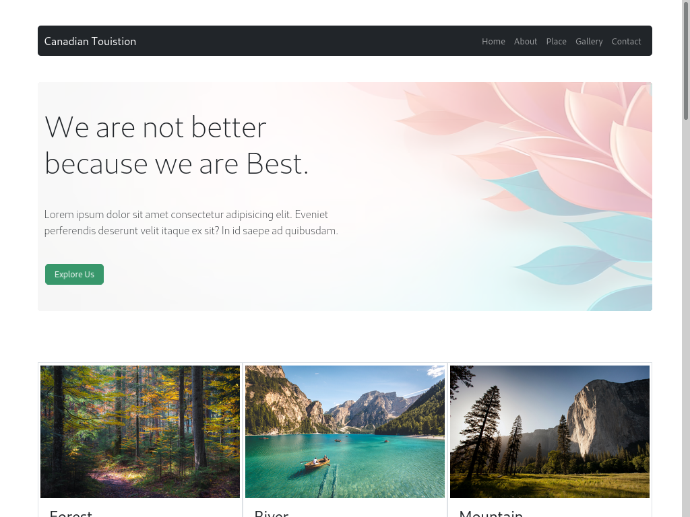

# website-19

- Name : "Tourism"

- Description : "Create Imagination Tourism website for competition"

- Version : 1.2

- Update : 01-10-2023

- Status : REST

- Responsive : True

- TecStack : { HTML | CSS | JavaScript | Bootstrap }

- Thanks : { VSCodium | GitHub | Bootstrap | Unplash }

- Work : Self

- Design : { Mayank }

- Developer : { Mayank | Vinay }

- CopyRight : { Mayank | Vinay }

- URL : https://mayankdevil.github.io/website-19/

- Clone : https://github.com/MayankDevil/website-19.git

- Download : https://github.com/MayankDevil/website-19/archive/refs/heads/main.zip

---

### Home Page

## Responsive

_this website is very responsive webpages, thanks by bootstrap framewrok_

**SCREEN** { 1200PX | 992PX | 785PX | 556PX }

## INFOMATION

_this is self preparation tourism imagination website develope for Competiiton with my teammate **vinay sharma** <https://github.com/VinaySharma77/> you checkout in my following_

